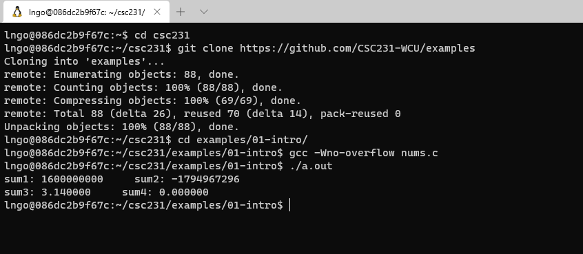
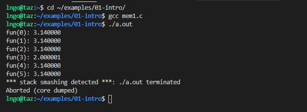
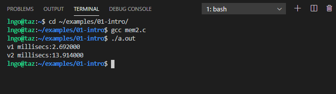
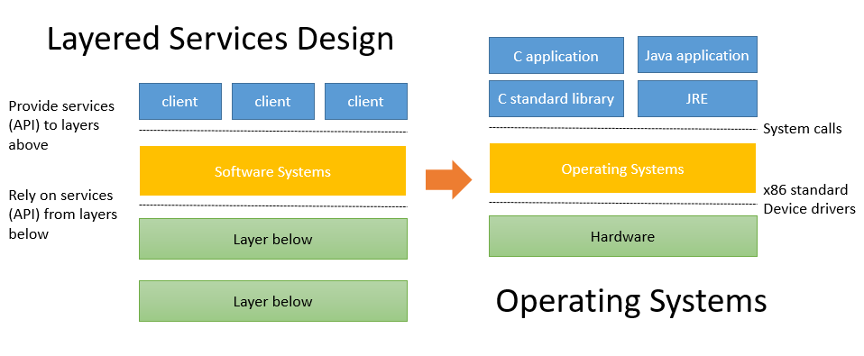

> ## Overview     
>  
>  - **Systems** knowledge is power!
>    - How hardware (processors, memories, disk drives, network infrastructure) plus
>    software (operating systems, compilers, libraries, network protocols) combine
>    to support the execution of application programs. 
>    - How general-purpose software developers can best use these resources. 
>    - A new specialization: systems programming. 
{: .slide}

> ## Understand how things work
>
> - Why do I need to know this stuff?
>   - Abstraction is good, but don’t forget reality
> - Most CS courses emphasize abstraction
>   - Abstract data types
>   - Asymptotic analysis
> - These abstractions have limits
>   - Especially in the presence of bugs
>   - Need to understand details of underlying implementations
>   - Sometimes the abstract interfaces don’t provide the level 
>   of control or performance you need
{: .slide}

> ## Hands-on 1: Getting started
>
> - Open a terminal (Windows Terminal or Mac Terminal).  
> - Reminder: It is `podman` on Windows and `docker` on Mac. Everything else 
> is the same!. 
> - Launch the container: 
>
> > ## Windows:
> >
> > ~~~
> > $ podman run --rm --userns keep-id --cap-add=SYS_PTRACE --security-opt seccomp=unconfined -it -p 2222:22 -v /mnt/c/csc231:/home/$USER/csc231:Z localhost/csc-container /bin/bash
> > ~~~
> > {: .language-bash}
> >
> {:.slide}
>
> > ## Mac:
> >
> > ~~~
> > $ podman run --rm --userns keep-id --cap-add=SYS_PTRACE --security-opt seccomp=unconfined -it -p 2222:22 -v /Users/$USER/csc231:/home/$USER/csc231:Z localhost/csc-container /bin/bash
> > ~~~
> > {: .language-bash}
> >
> {:.slide}
>
> - Once inside the container, clone the `examples` repository, and 
> compile and run the example: 
>
> ~~~
> $ cd csc231
> $ git clone https://github.com/CSC231-WCU/examples.git
> $ cd examples/01-intro
> $ gcc -Wno-overflow nums.c
> $ ./a.out
> ~~~
> {: .language-bash}
>
> 
> 
{: .slide}

> ## Computer arithmetic
>
> - Does not generate random values
>   - Arithmetic operations have important mathematical properties. 
> - Cannot assume all **usual** mathematical properties.
>   - Due to finiteness of representations. 
>   - Integer operations satisfy **ring** properties: commutativity, associativity, distributivity.
>   - Floating point operations satisfy **ordering** properties: monotonicity, values of signs. 
> - Observation
>   - Need to understand which abstractions apply in which contexts. 
>   - Important issues for compiler writers and application programmers. 
{: .slide}

> ## Assembly
>
> - You are more likely than not to never write programs in assembly. 
>   - Compilers take care of this for you. 
> - Understand assembly is key to machine-level execution model. 
>   - Behavior of programs in presence of bugs
>     - High-level language models break down
>   - Tuning program performance
>     - Understand optimizations done / not done by the compiler
>     - Understanding sources of program inefficiency
>   - Implementing system software
>     - Compiler has machine code as target
>     - Operating systems must manage process state
>   - Creating / fighting malware
>     - x86 assembly is the language of choice!
{: .slide}

> ## Memory Matters
>
> - Random Access Memory is an unphysical abstraction.
> - Memory is not unbounded. 
>   - It must be allocated and managed.
>   - Many applications are memory dominated. 
> - Memory referencing bugs are especially pernicious
>   - **Pernicious**: having a harmful effect, especially in a gradual or subtle way.
>   - Effects are distant in both time and space. 
> - Memory performance is not uniform.
>   - Cache and virtual memory effects can greatly affect program performance. 
>   - Adapting program to characteristics of memory system can lead to major speed improvements
{: .slide}

> ## Hands-on 2: Memory referencing bug
>
> - We are still inside `examples\intro-01` directory from Hands-on 1.   
>
> ~~~
> $ gcc mem1.c
> $ ./a.out
> ~~~
> {: .language-bash}
> 
> 
> 
{: .slide}

> ## Memory referencing errors
>
> - C and C++ do not provide any memory protection
>   - Out of bounds array references
>   - Invalid pointer values
>   - Abuses of `malloc`/`free`
> - Can lead to nasty bugs
>   - Whether or not bug has any effect depends on system and compiler
>   - Action at a distance
>     - Corrupted object logically unrelated to one being accessed
>     - Effect of bug may be first observed long after it is generated
> - How can I deal with this?
>   - Program in Java, Ruby, Python, ML, …
>   - Understand what possible interactions may occur
>   - Use or develop tools to detect referencing errors (e.g. Valgrind)
{: .slide}

> ## Beyond asymptotic complexity
>
> - Constant factors matter!
> - Exact op count does not predict performance.
>   - Possible 10:1 performance range depending on how code written (given same op count).
>   - Optimizations must happen at multiple level: algorithm, data representations, procedures, and loop.
> - Must understand system to optimize performance
>   - How programs compiled and executed.
>   - How to measure program performance and identify bottlenecks. 
>   - How to improve performance without destroying code modularity and generality. 
{: .slide}

> ## Hands-on 3: Memory system performance
>
> - We are still inside `examples\intro-01` directory from Hands-on 1.  
>
> ~~~
> $ gcc mem2.c
> $ ./a.out
> ~~~
> {: .language-bash}
> 
> 
> 
{: .slide}

> ## Does computer just execute arithmetic and control flow operations?
>
> - They need to get data in and out
>   - I/O system critical to program reliability and performance
> - They communicate with each other over networks
>   - Many system-level issues arise in presence of network
>   - Concurrent operations by autonomous processes
>   - Coping with unreliable media
>   - Cross platform compatibility
>   - Complex performance issues
{: .slide}

> ## Layered Services
>
> - Direct communication between applications and hardware components are impractical due
> to complexity. 
> - Operating systems provide much-needed interfaces between applications and hardware 
> through:
>   - OS/application interface: `system calls`.
>   - HW/SW interface: `x86 standard` and `device drivers`. 
> - Systems programming: develop software systems that ...
>   - are composed of multiple modules
>   - are complex
>   - meets specific requirements in aspects such as performance, security, or fault tolerance.
>
> 
>
{: .slide}



