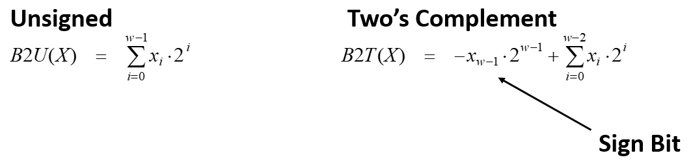
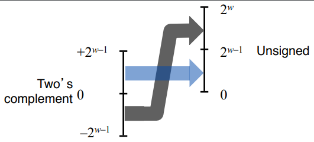
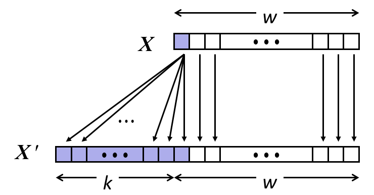
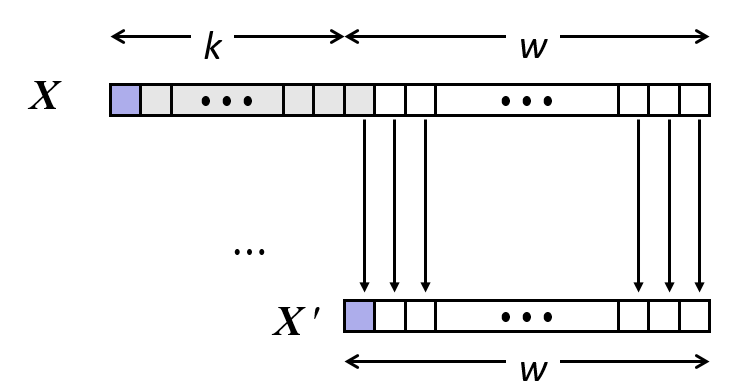

**Read chapter 2 of textbook.**

> ## 1. Everything is bits     
>  
> - Each bit is `0` or `1`
> - By encoding/interpreting sets of bits in various ways
>   - Computers determine what to do (instructions)
>   - … and represent and manipulate numbers, sets, strings, etc…
> - Why bits?  Electronic Implementation
>   - Easy to store with bistable elements.
>   - Reliably transmitted on noisy and inaccurate wires. 
>
> 
{: .slide}

> ## 2. Encoding byte values
> - Byte = 8 bits
> - Binary: `0000 0000` to `1111 1111`. 
> - Decimal: `0` to `255`. 
> - Hexadecimal: `00` to `FF`. 
>   - Base 16 number representation
>   - Use character `0` to `9` and `A` to `F`. 
> - Example: 15213 (decimal) = 0011 1011 0110 1101 (binary) = 3B6D (hex)
> 
> |  |  |  |  |  |  |  |  |  |  |  |  |  |  |  |  |  |
> | --- | --- | --- | --- |  --- | --- | --- | --- |  --- | --- | --- | --- |  --- | --- | --- | --- | 
> | Hex | 0 | 1 | 2 | 3 | 4 | 5 | 6 | 7 | 8 | 9 | A | B | C | D | E | F |
> | --- | --- | --- | --- |  --- | --- | --- | --- |  --- | --- | --- | --- |  --- | --- | --- | --- | 
> | Decimal | 0 | 1 | 2 | 3 | 4 | 5 | 6 | 7 | 8 | 9 |10 | 11 | 12 | 13 | 14 | 15 |
> | --- | --- | --- | --- |  --- | --- | --- | --- |  --- | --- | --- | --- |  --- | --- | --- | --- | 
> | Binary	| 0000 | 0001 | 0010 | 0011 | 0100 | 0101 | 0110 | 0111 | 1000 | 1001 |1010 | 1011 | 1100 | 1101 | 1110 | 1111 |
>
{: .slide}

> ## 3. Example data representations
> 
> | C data type | typical 32-bit | typical 64-bit | x86_64  |  
> | ----------- | -------------- | -------------- | ------- |  
> | char        | 1              | 1              | 1       |  
> | short       | 2              | 2              | 3       |  
> | int         | 4              | 4              | 4       |  
> | long        | 4              | 8              | 8       |  
> | float       | 4              | 4              | 4       |  
> | double      | 8              | 8              | 8       |  
> | pointer     | 4              | 8              | 8       |  
>
{: .slide}

> ## 4. Boolean algebra
> 
> - Developed by George Boole in 19th century
> - Algebraic representation of logic: encode `True` as `1` and `False` as `0`. 
> - Operations: `AND` (`&`), `OR` (`|`), `XOR` (`^`), `NOT` (`~`).
> 
> | A | B | A&B  | A|B  | A^B | ~A |
> | - | - | ---- | ---- | --- | -- | 
> | 0 | 0 | 0    | 0    | 0   | 1  |
> | 0 | 1 | 0    | 1    | 1   | 1  |
> | 1 | 0 | 0    | 1    | 1   | 0  |
> | 1 | 1 | 1    | 1    | 0   | 0  |  
{: .slide}

> ## 5. General Boolean algebra
> 
> - Operate on bit vectors
> - Operation applied bitwise. 
> - All properties of boolean algebra apply.  
> 
> 
{: .slide}

> ## 6. Bit-level operations in  C
> 
> - Boolean operations: `&`, `|`, `^`, `~`.
> - Shift operations:
>   - Left Shift: 	x << y
>     - Shift bit-vector x left y positions
>     - Throw away extra bits on left
>     - Fill with 0’s on right
>   - Right Shift: 	x >> y
>     - Shift bit-vector x right y positions
>     - Throw away extra bits on right
>     - Logical shift (for unsigned values)
>       - Fill with 0’s on left
>     - Arithmetic shift (for signed values)
>       - Replicate most significant bit on left
>   - Undefined Behavior
>     - Shift amount < 0 or ≥ word size
> - Apply to any "integral" data type: long, int, short, char, unsigned
> - View arguments as bit vectors. 
> - Arguments applied bit-wise. 
> 
{: .slide}

> ## 7. Hands-on: bit-level operations in C
>
> - In your home directory, create a directory called `03-data` and change into this directory.
> - Create a file named `bitwise_demo.c` with the following contents:
> 
> 
> 
> - Compile and run `bitwise_demo.c`.
> - Confirm that the binary printouts match the corresponding decimal printouts and the expected bitwise
> operations. 
>
{: .slide}

> ## 8. Encoding integers
> 
> 
>
> - C does not mandate using 2's complement. 
>   - But, most machines do, and we will assume so. 
>
> |             | Decimal | Hex   | Binary            |
> | ----------- | ------- | ----- | ----------------- | 
> | short int x | 15213   | 3B 6D | 00111011 01101101 |  
> | short int y | -15213  | C4 93 | 11000100 10010011 | 
>
> - Sign bit
>   - For 2's complement, most significant bit indicates sign.   
>   - 0 for nonnegative
>   - 1 for negative
>
{: .slide}

> ## 9. 2's complement examples
>
> - Simple example 
>
> |     | -16 | 8  | 4  | 2 | 1 |                   |
> | --  | --- | -- | -- | - | - | ----------------- |  
> | 10  | 0   | 1  | 0  | 1 | 0 | 8 + 2 = 10        |  
> | -10 | 1   | 0  | 1  | 1 | 0 | -16 + 4 + 2 = 10  |
>
> - Complex example
>
> |             | Decimal | Hex   | Binary            |
> | ----------- | ------- | ----- | ----------------- | 
> | short int x | 15213   | 3B 6D | 00111011 01101101 |  
> | short int y | -15213  | C4 93 | 11000100 10010011 |
>
> | Weight | 15213 |       | -15213 |        |
> | ------ | ----- | ----- | ------ | ------ |
> | 1      | 1     | 1     | 1      | 1      |
> | 2      | 0     | 0     | 1      | 2      |
> | 4      | 1     | 4     | 0      | 0      |
> | 8      | 1     | 8     | 0      | 0      |
> | 16     | 0     | 0     | 1      | 16     |
> | 32     | 1     | 32    | 0      | 0      |
> | 64     | 1     | 64    | 0      | 0      |
> | 128    | 0     | 0     | 1      | 128    |
> | 256    | 1     | 256   | 0      | 0      |
> | 512    | 1     | 512   | 0      | 0      |
> | 1024   | 0     | 0     | 1      | 1024   |
> | 2048   | 1     | 2048  | 0      | 0      |
> | 4096   | 1     | 4096  | 0      | 0      |
> | 8192   | 1     | 8192  | 0      | 0      |
> | 16384  | 0     | 0     | 1      | 16384  |
> | -32768 | 0     | 0     | 1      | -32768 |
> | ------ | ----- | ----- | ------ | ------ |
> | Sum    |       | 15213 |        | -15213 |
{: .slide}

> ## 10. Numeric ranges
>
> - Unsigned values for `w-bit` word
>   - UMin = 0
>   - UMax = 2w - 1
> - 2's complement values for `w-bit` word
>   - TMin = -2w-1
>   - TMax = 2w-1 - 1
>   - -1: 111..1
>
> - Values for different word sizes:
>
> |      | 8    | 16      | 32             | 64                         |
> | ---- | ---- | ------- | -------------- | -------------------------- |
> | UMax | 255  | 65,535  | 4,294,967,295  | 18,446,744,073,709,551,615 |
> | TMax | 127  | 32,767  | 2,147,483,647  | 9,223,372,036,854,775,807  |
> | TMin | -128 | -32,768 | -2,147,483,648 | -9,223,372,036,854,775,808 | 
>
> - Observations
>   - abs(TMin) = TMax + 1
>     - Asymetric range
>   - UMax = 2 * TMax + 1
> 
>  - C programming
>    - `#include <limits.h>`
>    - Declares constants: `ULONG_MAX`, `LONG_MAX`, `LONG_MIN`
>    - Platform specific
{: .slide}

> ## 11. Challenge
> 
> - Write a C program called `numeric_ranges.c` that prints out the 
> value of `ULONG_MAX`, `LONG_MAX`, `LONG_MIN`. Also answer the following 
> question: If we multiply `LONG_MIN` by -1, what do we get?
> - Note: You need to search for the correct format string specifiers. 
>
> > ## Solution
> > 
> >
> {: .solution}
{: .challenge}
 
> ## 12. Conversions (casting)
> 
> - C allows casting between different numeric data types. 
> - What should be the effect/impact?
> - Notations:
>   - B2T: Binary to 2's complement
>   - B2U: Binary to unsigned 
>   - U2B: Unsigned to binary
>   - U2T: Usigned to 2's complement
>   - T2B: 2's complement to binary
>   - T2U: 2's complement to unsigned
> 
{: .slide}

> ## 13. Visualization of conversions
> 
> 
> 
>  - T2Uw(x) = x + 2w if x < 0
>  - T2Uw(x) = x if x >= 0
>
> 
>
>  - U2Tw(x) = x - 2w if x > TMaxw
>  - U2Tw(x) = x if x <= TMaxw
>
> - Summary
>   - Bit pattern is maintained but reinterpreted
>   - Can have unexpected effects: adding or subtracting 2w
>   - When expressions contain both signed and unsigned int values, int values will be casted to unsigned. 
{: .slide}

> ## 14. Hands on: casting
>
> - Make sure that you are inside `03-data` directory.
> - Create a file named `casting.c` with the following contents:
> 
> 
> 
> - Compile and run `casting.c`.
> - Confirm that converted values are correct based on equations from slide 13. 
>
{: .slide}

> ## 15. Challenge
> 
> - What is wrong with the following program? 
> - How can this program be corrected?
>
> > ## Solution
> > 
> >
> {: .solution}
{: .challenge}

> ## 16. Expanding and truncation
> 
> - Expanding (e.g., short int to int)
>   - Unsigned: zeros added
>   - Signed: sign extension
>   - Both yield expected result
>
> 
>
> - Truncating (e.g., unsigned to unsigned short)
>   - Unsigned/signed: bits are truncated
>   - Result reinterpreted
>   - Unsigned: mod operation
>   - Signed: similar to mod
>   - For small (in magnitude) numbers yields expected behavior
>
> 
{: .slide}

> ## 17. Misunderstanding integers can lead to the end of the world!
> 
> - [Thule Site J](https://en.wikipedia.org/wiki/Thule_Site_J): USAF radar station for
> missile warning and spacecraft tracking. 
> - "There are many examples of errors arising from incorrect or incomplete specifications. 
> One such example is a false alert in the early days of the nuclear age, when on 
> October 5, 1960, the warning system at NORAD indicated that the United States was 
> under massive attack by Soviet missiles with a certainty of 99.9 percent. It turned 
> out that the Ballistic Missile Early Warning System (BMEWS) radar in Thule, 
> Greenland, had spotted the rising moon. Nobody had thought about the moon when specifying 
> how the system should act." (Computer System Reliability and Nuclear War, CACM 1987).
> - Moon's large size: 1000s of objects reported. 
> - Moon's distance: .25 million miles
>   - Thule's BMEWS max distance: 3000 miles. 
>   - Truncated distance to the moon: % sizeof(distance) = 2200 miles. 
> - Remember assignment 1: The computer does not "see", it only interprets.
>   - **Thousands of objects on the sky within missile detection range!**. 
> - Human control:
>   - Kruschev was in New York on October 5, 1960. 
>   - Someone at Thule said, "why not go check outside?"
{: .slide}



