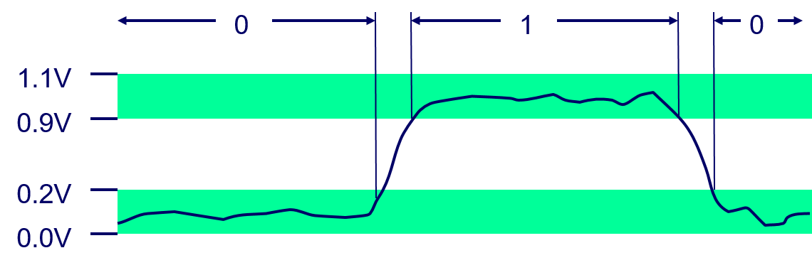

**Read chapter 2 of textbook.**

> ## Everything is bits     
>  
> - Each bit is `0` or `1`
> - By encoding/interpreting sets of bits in various ways
>   - Computers determine what to do (instructions)
>   - … and represent and manipulate numbers, sets, strings, etc…
> - Why bits?  Electronic Implementation
>   - Easy to store with bistable elements.
>   - Reliably transmitted on noisy and inaccurate wires. 
>
> 
{: .slide}

> ## Encoding byte values
> - Byte = 8 bits
> - Binary: `0000 0000` to `1111 1111`. 
> - Decimal: `0` to `255`. 
> - Hexadecimal: `00` to `FF`. 
>   - Base 16 number representation
>   - Use character `0` to `9` and `A` to `F`. 
> - Example: 15213 (decimal) = 0011 1011 0110 1101 (binary) = 3B6D (hex)
> 
> |  |  |  |  |  |  |  |  |  |  |  |  |  |  |  |  |  |
> | --- | --- | --- | --- |  --- | --- | --- | --- |  --- | --- | --- | --- |  --- | --- | --- | --- | 
> | Hex | 0 | 1 | 2 | 3 | 4 | 5 | 6 | 7 | 8 | 9 | A | B | C | D | E | F |
> | --- | --- | --- | --- |  --- | --- | --- | --- |  --- | --- | --- | --- |  --- | --- | --- | --- | 
> | Decimal | 0 | 1 | 2 | 3 | 4 | 5 | 6 | 7 | 8 | 9 |10 | 11 | 12 | 13 | 14 | 15 |
> | --- | --- | --- | --- |  --- | --- | --- | --- |  --- | --- | --- | --- |  --- | --- | --- | --- | 
> | Binary	| 0000 | 0001 | 0010 | 0011 | 0100 | 0101 | 0110 | 0111 | 1000 | 1001 |1010 | 1011 | 1100 | 1101 | 1110 | 1111 |
>
{: .slide}

> ## Example data representations
> 
> | C data type | typical 32-bit | typical 64-bit | x86_64  |  
> | ----------- | -------------- | -------------- | ------- |  
> | char        | 1              | 1              | 1       |  
> | short       | 2              | 2              | 3       |  
> | int         | 4              | 4              | 4       |  
> | long        | 4              | 8              | 8       |  
> | float       | 4              | 4              | 4       |  
> | double      | 8              | 8              | 8       |  
> | pointer     | 4              | 8              | 8       |  
>
{: .slide}

> ## Boolean algebra
> 
> - Developed by George Boole in 19th century
> - Algebraic representation of logic: encode `True` as `1` and `False` as `0`. 
> - Operations: `AND` (`&`), `OR` (`|`), `XOR` (`^`), `NOT` (`~`).
> 
> | A | B | A&B  | A|B  | A^B | ~A |
> | - | - | ---- | ---- | --- | -- | 
> | 0 | 0 | 0    | 0    | 0   | 1  |
> | 0 | 1 | 0    | 1    | 1   | 1  |
> | 1 | 0 | 0    | 1    | 1   | 0  |
> | 1 | 1 | 1    | 1    | 0   | 0  |  
{: .slide}

> ## General Boolean algebra
> 
> - Operate on bit vectors
> - Operation applied bitwise. 
> - All properties of boolean algebra apply.  
> 
> 
{: .slide}

> ## Bit-level operations in  C
> 
> - Boolean operations: `&`, `|`, `^`, `~`.
> - Shift operations:
>   - Left Shift: 	x << y
>     - Shift bit-vector x left y positions
>     - Throw away extra bits on left
>     - Fill with 0’s on right
>   - Right Shift: 	x >> y
>     - Shift bit-vector x right y positions
>     - Throw away extra bits on right
>     - Logical shift (for unsigned values)
>       - Fill with 0’s on left
>     - Arithmetic shift (for signed values)
>       - Replicate most significant bit on left
>   - Undefined Behavior
>     - Shift amount < 0 or ≥ word size
> - Apply to any "integral" data type: long, int, short, char, unsigned
> - View arguments as bit vectors. 
> - Arguments applied bit-wise. 
> 
{: .slide}

> ## Hands-on 1: bit-level operations in C
>
> - In your home directory, create a directory called `03-data` and change into this directory.
> - Create a file named `bitwise_demo.c` with the following contents:
> 
> 
> 
> - Compile and run `bitwise_demo.c`.
> - Confirm that the binary printouts match the corresponding decimal printouts and the expected bitwise
> operations. 
>
{: .slide}
 


