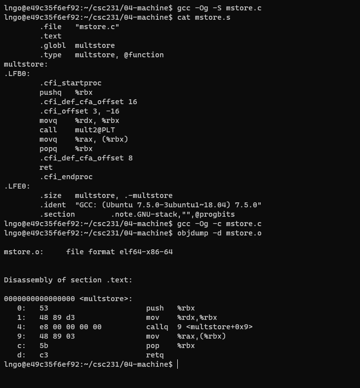
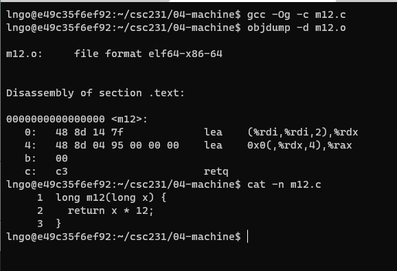
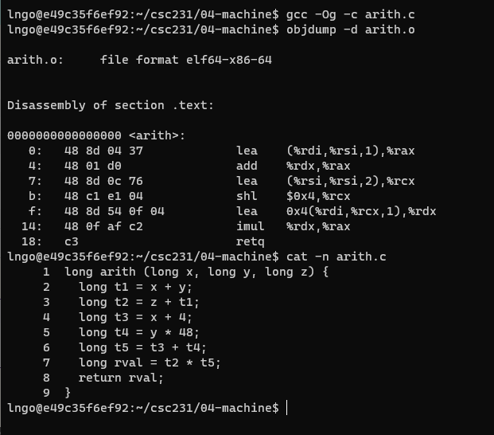
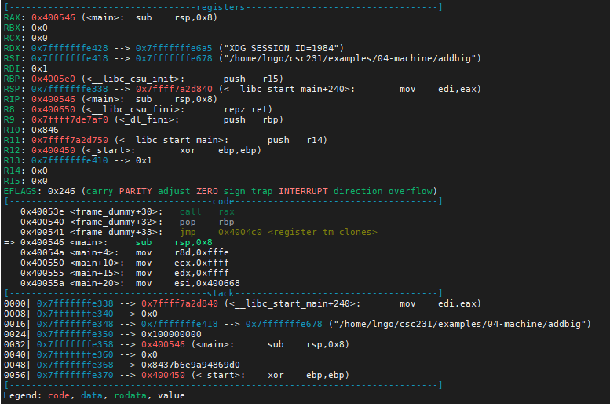
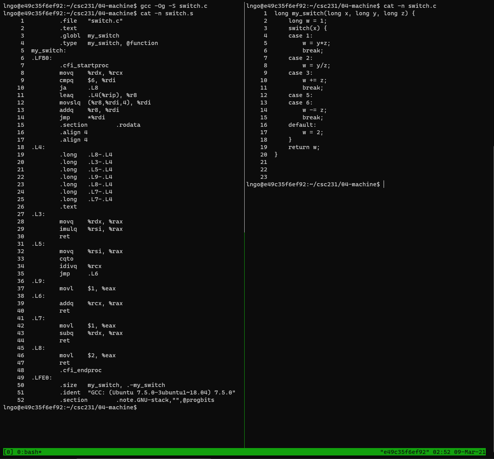
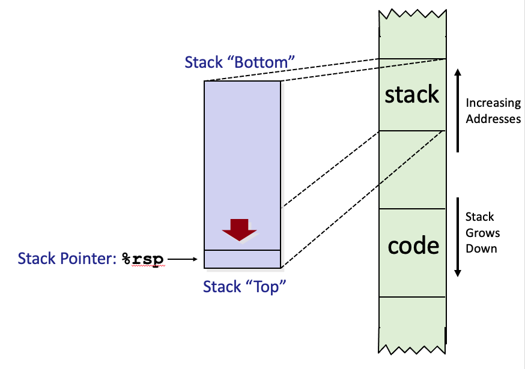

> ## 1. Intel x86 processors
> - Dominate laptop/desktop/server market
> - Evolutionary design
>   - Backwards compatible up until 8086, introduced in 1978
>   - Added more features as time goes on
> - x86 is a Complex Instruction Set Computer (CISC)
>   - Many different instructions with many different formats
>   - But, only small subset encountered with Linux programs
> - Compare: Reduced Instruction Set Computer (RISC)
>   - RISC: *very few* instructions, with *very few* modes for each
>   - RISC can be quite fast (but Intel still wins on speed!)
>   - Current RISC renaissance (e.g., ARM, RISC V), especially for low-power
{: .slide}

> ## 2. Intel x86 processors: machine evolution
>
> | Name            | Date | Transistor Counts |  
> | --------------- | ---- | ----------------- |  
> | 386             | 1985 | 0.3M              |   
> | Pentium         | 1993 | 3.1M              |  
> | Pentium/MMX     | 1997 | 4.5M              |  
> | Pentium Pro     | 1995 | 6.5M              |  
> | Pentium III     | 1999 | 8.2M              |  
> | Pentium 4       | 2000 | 42M               |  
> | Core 2 Duo      | 2006 | 291M              |  
> | Core i7         | 2000 | 42M               |  
> | Core i7 Skylake | 2006 | 291M              |  
>
>
> - Added features
>   - Instructions to support multimedia operations
>   - Instructions to enable more efficient conditional operations (**!**)
>   - Transition from 32 bits to 64 bits
>   - More cores
{: .slide}

> ## 3. x86 clones: Advanced Micro Devices (AMD)
> - Historically
>   - AMD has followed just behind Intel
>   - A little bit slower, a lot cheaper
> - Then
>   - Recruited top circuit designers from Digital Equipment Corp. 
>   and other downward trending companies
>   - Built Opteron: tough competitor to Pentium 4
>   - Developed x86-64, their own extension to 64 bits
> - Recent Years
>   - Intel got its act together
>     - 1995-2011: Lead semiconductor “fab” in world
>     - 2018: #2 largest by $$ (#1 is Samsung)
>     - 2019: reclaimed #1
> - AMD fell behind
>   - Relies on external semiconductor manufacturer GlobalFoundaries
>   - ca. 2019 CPUs (e.g., Ryzen) are competitive again
>   - 2020 Epyc
> 
> 
> 
{: .slide}

> ## 4. Machine programming: levels of abstraction
>
> 
>
> - `Architecture`: (also `ISA`: instruction set architecture) The parts of a processor 
> design that one needs to understand for writing correct machine/assembly code
>   - Examples:  instruction set specification, registers
>   - `Machine Code`: The byte-level programs that a processor executes
>   - `Assembly Code`: A text representation of machine code
> - `Microarchitecture`: Implementation of the architecture
>   - Examples: cache sizes and core frequency
> - Example ISAs: 
>   - Intel: x86, IA32, Itanium, x86-64
>   - ARM: Used in almost all mobile phones
>   - RISC V: New open-source ISA
{: .slide}

> ## 5. Assembly/Machine code view
>
> - Machine code (Assembly code) differs greatly from the original C code. 
> - Parts of processor state that are not visible/accessible from C programs 
> are now visible. 
>   - PC: Program counter
>     - Contains address of next instruction
>     - Called `%rip` (instruction pointer register)
>   - Register file
>     - contains 16 named locations (registers), each can store 64-bit values. 
>     - These registers can hold addresses (~ C pointers) or integer data. 
>   - Condition codes
>     - Store status information about most recent arithmetic or 
>     logical operation
>     - Used for conditional branching (`if`/`while`)
>   - Vector registers to hold one or more integers or floating-point values. 
>   - Memory
>     - Is seen  as a byte-addressable array
>     - Contains code and user data
>     - Stack to support procedures
>
>
> 
>
{: .slide}

> ## 6. Hands on: assembly/machine code example
>
> - In your home directory, create a directory called `04-machine` and change into this directory.
> - Create a file named `mstore.c` with the following contents:
>
> 
>
> - Run the following commands 
> *It is capital o, not number 0*
>
> ~~~
> $ gcc -Og -S mstore.c
> $ cat mstore.s
> $ gcc -Og -c mstore.c
> $ objdump -d mstore.o
> ~~~
> {: .language-bash}
>
> 
>
> - x86_64 instructions range in length from 1 to 15 bytes
> - The disassembler determines the assembly code based purely on the 
> byte-sequence in the machine-code file. 
> - All lines begin with `.`  are directirves to the assembler and linker. 
{: .slide}

> ## 7. Data format
>
> 
> | C data type | Intel data type  | Assembly-code suffix | Size  |  
> | ----------- | ---------------- | -------------------- | ----- |  
> | char        | Byte             | b                    | 1     |  
> | short       | Word             | w                    | 2     |  
> | int         | Double word      | l                    | 4     |  
> | long        | Quad word        | q                    | 8     |  
> | char *      | Quad word        | q                    | 8     |  
> | float       | Single precision | s                    | 4     |  
> | double      | Double precision | l                    | 8     |  
>
{: .slide}

> ## 8. Integer registers
>
> - x86_64 CPU contains a set of 16 `general purpose registers` storing 64-bit values.  
> - Original 8086 design has eight 16-bit registers, `%ax` through `%sp`. 
>   - Origin (mostly obsolete)
>     - `%ax`: accumulate
>     - `%cx`: counter
>     - `%dx`: data
>     - `%bx`: base
>     - `%si`: source index
>     - `%di`: destination index
>     - `%sp`: stack pointer
>     - `%bp`: base pointer
> - After IA32 extension, these registers grew to 32 bits, labeled `%eax` through `%esp`. 
> - After x86_64 extension, these registers were expanded to 64 bits, labeled `%rax` 
> through `%rsp`. Eight new registered were added: `%r8` through `%r15`. 
> - Instructions can operate on data of different sizes stored in low-order bytes of the
> 16 registers. 
>
> 
> *Bryant and O' Hallaron, Computer Systems: A Programmer's Perspective, Third Edition*
{: .slide}

> ## 9. Assembly characteristics: operations
>
> - Transfer data between memory and register
>   - Load data from memory into register
>   - Store register data into memory
> - Perform arithmetic function on register or memory data
> - Transfer control
>   - Unconditional jumps to/from procedures
>   - Conditional branches
>   - Indirect branches
{: .slide}

> ## 10. Data movement
> - Example: `movq Source, Dest`
> - Note: This is ATT notation. Intel uses `mov Dest, Source`
> - Operand Types:
>   - Immediate (Imm): Constant integer data. 
>      - `$0x400`, `$-533`. 
>      - Like C constant, but prefixed with `$`.
>      - Encoded with 1, 2, or 4 bytes. 
>   - Register (Reg): One of 16 integer registers
>      - Example: `%rax`, `%r13`
>      - `%rsp` reserved for special use. 
>      - Others have special uses in particular instructions. 
>   - Memory (Mem): 8 (`q` in `movq`) consecutive bytes of memory at 
>   address given by register. 
>      - Example: `(%rax)`
>      - Various other **addressing mode** (See textbook page 181, Figure 3.3). 
> - Other `mov`:
>   - `movb`: move byte
>   - `movw`: move word
>   - `movl`: move double word
>   - `movq`: move quad word
>   - `moveabsq`: move absolute quad word
{: .slide}

> ## 11. movq Operand Combinations
>
> | `movq` | Source | Dest  | Src, Dest           |  C Analog    |
> | ------ | ------ | ----- | ------------------- | ------------ |
> |        | Imm    | Reg   | `movq $0x4, %rax`   | tmp = 0x4;   |
> |        | Imm    | Mem   | `movq $-147,(%rax)` | *p = -147;   |
> |        | Reg    | Reg   | `movq %rax,%rdx`    | tmp2 = tmp1; |
> |        | Reg    | Mem   | `movq %rax,(%rdx)`  | *p = tmp;    |
> |        | Mem    | Reg   | `movq (%rax),%rdx`  | tmp = *p;    |
{: .slide}

> ## 12. Simple memory addressing mode
>
> - Normal:	(R)	Mem[Reg[R]]
>   - Register R specifies memory address
>   - Aha! Pointer dereferencing in C
>   - `movq (%rcx),%rax`
> - Displacement	D(R)	Mem[Reg[R]+D]
>   - Register R specifies start of memory region
>   - Constant displacement D specifies offset
>   - `movq 8(%rbp),%rdx`
{: .slide}

> ## 13. x86_64 Cheatsheet
>
> [Brown University - Dr. Doeppner](https://cs.brown.edu/courses/cs033/docs/guides/x64_cheatsheet.pdf)
>
{: .slide}

> ## 14. Hands on: data movement
>
> - Create a file named `swap.c` in `04-machine` with the following contents:
>
> 
>
> - Run the following commands 
>
> ~~~
> $ gcc -Og -c swap.c
> $ objdump -d swap.o
> ~~~
> {: .language-bash}
>
> 
>
> - [Why `%rsi` and `%rdi`?](http://6.s081.scripts.mit.edu/sp18/x86-64-architecture-guide.html)
{: .slide}

> ## 15. Hands on: data movement
>
> - Create a file named `swap_dsp.c` in `04-machine` with the following contents:
>
> 
>
> - Run the following commands 
>
> ~~~
> $ gcc -Og -c swap_dsp.c
> $ objdump -d swap_dsp.o
> ~~~
> {: .language-bash}
>
> 
>
> - What is the meaning of `0x190`?
{: .slide}

> ## 16. Complete memory addressing mode
>
> - Most General Form
>   - `D(Rb,Ri,S)`: `Mem[Reg[Rb]+S*Reg[Ri]+ D]`
>   - D: 	Constant **displacement** 1, 2, or 4 bytes
>   - Rb: Base register: Any of 16 integer registers
>   - Ri:	Index register: Any, except for `%rsp`
>   - S: Scale: 1, 2, 4, or 8 
> - Special Cases
>   - `(Rb,Ri)`:	`Mem[Reg[Rb]+Reg[Ri]]`
>   - `D(Rb,Ri)`: `Mem[Reg[Rb]+Reg[Ri]+D]`
>   - `(Rb,Ri,S)`: `Mem[Reg[Rb]+S*Reg[Ri]]`
>   - `(,Ri,S)`: `Mem[S*Reg[Ri]]`
>   - `D(,Ri,S)`: `Mem[S*Reg[Ri] + D]`
>
{: .slide}

> ## 17. Arithmetic and logical operations: lea
>
> - `lea`: load effective address
> - A form of `movq` intsruction
>   - `lea S, D`: Write `&S` to `D`. 
>   - can be used to generate pointers
>   - can also be used to describe common arithmetic operations. 
{: .slide}

> ## 18. Hands on: lea
>
> - Create a file named `m12.c` in `04-machine` with the following contents:
>
> 
>
> - Run the following commands 
>
> ~~~
> $ gcc -Og -c m12.c
> $ objdump -d m12.o
> ~~~
> {: .language-bash}
>
> 
>
> - Review slide 16
> - `%rdi`: x
> - `(%rdi, %rdi,2)` = x + 2 * x 
> - The above result is moved to `%rdx` with `lea`. 
> - `0x0(,%rdx,4)` = 4 * (x + 2 * x) = 12*x
> - The above result is moved to `%rax` with `lea`. 
{: .slide}

> ## 19. Other arithmetic operations
>
> - Omitting suffixes comparing to the book. 
>
> | Format          | Computation |  Description       |
> | --------------- | ----------- | ------------------ |  
> | `add Src,Dest`  | D <- D + S  | add                |   
> | `sub Src,Dest`  | D <- D - S  | subtract           |  
> | `imul Src,Dest` | D <- D * S  | multiply           |  
> | --------------- | ----------- | ------------------ |  
> | `shl Src,Dest`  | D <- D << S | shift left         |  
> | `sar Src,Dest`  | D <- D >> S | arith. shift right |  
> | `shr Src,Dest`  | D <- D >> S | shift right        |  
> | `sal Src,Dest`  | D <- D << S | arith. shift left  |  
> | --------------- | ----------- | ------------------ |  
> | `xor Src,Dest`  | D <- D ^ S  | exclusive or       |  
> | `and Src,Dest`  | D <- D & S  | and                |  
> | `or Src,Dest`   | D <- D \| S | or                 |  
> | --------------- | ----------- | ------------------ |  
> | `inc Src`       | D <- D + 1  | increment          |  
> | `dec Src`       | D <- D - 1  | decrement          |  
> | `neg Src`       | D <- -D     | negate             |  
> | `not Src`       | D <- -D     | complement         |  
>
>
> - Watch out for argument order (ATT versus Intel)
> - No distinction between signed and unsigned int. Why is that?
{: .slide}

> ## 20. Challenge: lea
>
> - Create a file named `scale.c` in `04-machine` with the following contents:
>
> 
>
> - Run the following commands 
>
> ~~~
> $ gcc -Og -c scale.c
> $ objdump -d scale.o
> ~~~
> {: .language-bash}
>
> 
>
> - Identify the registers holding x, y, and z.  
> - Which register contains the final return value?
>
> > ## Solution
> > - `%rdi`: x
> > - `%rsi`: y
> > - `%rdx`: z
> > - `%rax` contains the final return value. 
> {: .solution}
{: .challenge}

> ## 21. Hands on: long arithmetic
>
> - Create a file named `arith.c` in `04-machine` with the following contents:
>
> 
>
> - Run the following commands 
>
> ~~~
> $ gcc -Og -c arith.c
> $ objdump -d arith.o
> ~~~
> {: .language-bash}
>
> - Understand how the Assembly code represents the actual arithmetic operation in the C code. 
>
> 
>
{: .slide}

> ## 22. Quick review: processor state
>
> - Information about currently executing program
>   - temporary data (`%rax`,...)
>   - location of runtime stack (`%rsp`)
>   - location of current code control point (`%rip`,...)
>   - status of recent tests (`CF`, `ZF`, `SF`, `OF` in `%EFLAGS`)
>
> 
>
{: .slide}

> ## 23. Condition codes (implicit setting)
>
> - Single-bit registers
>   - `CF`: the most recent operation generated a carry out of the most significant bit. 
>   - `ZF`: the most recent operation yielded zero.
>   - `SF`: the most recent operation yielded negative. 
>   - `OF`: the most recent operation caused a two's-complement overflow. 
> - Implicitly set (as side effect) of arithmetic operations. 
>
{: .slide}

> ## 24. Condition codes (explicit setting)
>
> - Exlicit setting by Compare instruction
>   - `cmpq Src2, Src1`
>   - `cmpq b, a` like computing `a - b` without setting destination
> - `CF` set if carry/borrow out from most significant bit (unsigned comparisons) 
> - `ZF` set if `a == b`
> - `SF` set if `(a - b) < 0` 
> - `OF` set if two's complement (signed) overflow
>   - `(a>0 && b<0 && (a-b)<0) || (a<0 && b>0 && (a-b)>0)`
{: .slide}

> ## 24. Condition branches (jX)
>
> - Jump to different part of code depending on condition codes
> - Implicit reading of condition codes
> 
> | jX    | Condition      |  Description         |
> | ----- | -------------- | -------------------- |  
> | `jmp` | 1              | direct jump          |   
> | `je`  | ZF             | equal/zero           |  
> | `jne` | ~ZF            | not equal/not zero   |  
> | `js`  | SF             | negative             |  
> | `jns` | ~SF            | non-negative         |  
> | `jg`  | ~(SF^OF) & ~ZF | greater              |  
> | `jge` | ~(SF^OF)       | greater or equal to  |  
> | `jl`  | SF^OF          | lesser               |  
> | `jle` | SF^OF \| ZF    | lesser or equal to   |  
> | `ja`  | ~CF & ~ZF      | above                |    
> | `jb`  | CF             | below                |  
>
{: .slide}

> ## 25. Hands on: a simple jump
>
> - Create a file named `jump.c` in `04-machine` with the following contents:
>
> 
>
> - Run the following commands 
>
> ~~~
> $ gcc -Og -c jump.c
> $ objdump -d jump.o
> ~~~
> {: .language-bash}
>
> - Understand how the Assembly code enables jump across instructions to support conditional workflow. 
>
> 
> 
> - Rerun the above commands but ommit `-Og` flag. Think about the differences in the resulting Assembly code. 
{: .slide}

> ## 26. Hands on: loop
>
> - Create a file named `fact_loop.c` in `04-machine` with the following contents:
>
> 
>
> - Run the following commands 
>
> ~~~
> $ gcc -Og -c fact_loop.c
> $ objdump -d fact_loop.o
> ~~~
> {: .language-bash}
>
> - Understand how the Assembly code enables jump across instructions to support loop. 
>
> 
> 
> - Create `fact_loop_2.c` and `fact_loop_3.c` from `fact_loop`.c. 
> - Modify `fact_loop_2.c` so that the factorial is implemented with a `while` loop. Study the 
> resulting Assembly code. 
> - Modify `fact_loop_3.c` so that the factorial is implemented with a `for` loop. Study the 
> resulting Assembly code. 
{: .slide}

> ## 27. Hands on: switch
>
> - Create a file named `switch.c` in `04-machine` with the following contents:
>
> 
>
> - View `switch.c` and the resulting `switch.s` in a two-column tmux terminal. 
>
> ~~~
> $ gcc -Og -S switch.c
> ~~~
> {: .language-bash}
>
> 
> 
{: .slide}

> ## 28. Mechanisms in procedures
>
> - Passing control
>   - To beginning of procedure code
>   - Back to return point
> - Passing data
>   - Procedure arguments
>   - Return value
> - Memory management
>   - Allocate during procedure execution
>   - Deallocate upon return
> - Mechanisms all implemented with machine instructions
> - x86-64 implementation of a procedure uses only those mechanisms required
> - Machine instructions implement the mechanisms, but the choices are determined by designers. 
> These choices make up the **Application Binary Interface (ABI).**
{: .slide}

> ## 29. x86-64 stack
>
> - Region of memory managed with stack discipline
>   - Memory viewed as array of bytes.
>   - Different regions have different purposes.
>   - (Like ABI, a policy decision)
> - Grows toward lower addresses
>   - Register `%rsp` contains **lowest stack address**. 
>   - address of "top" element
>
> 
{: .slide}

> ## 30. Stack push and pop
> 
> - `pushq Src`
>   - Fetch operand at `Src`
>   - Decrement `%rsp` by 8
>   - Write operand at address given by `%rsp`
> - `popq Dest`
>   - Read value at address given by `%rsp`
>   - Increment `%rsp` by 8
>   - Store value at Dest (usually a register)
> 
{: .slide}

> ## 31. Hands on: function calls
>
> - Create a file named `mult.c` in `04-machine` with the following contents:
>
> 
>
> - Setup a two-column tmux terminal. 
> - Compile with `-g` flag run `gdb` on the left panel, and view the source code of 
> `mult.c` on the right panel.  
>
> ~~~
> $ gcc -g -Og -o mult mult.c
> ~~~
> {: .language-bash}
>
> - Setup gdb with a breakpoint at `main` and start running. 
> 
> 
>
> - Press `n` twice. We are now just before the call to function `multstore`. 
> 
> 
> 
> - Press `s` to step into `multstore`, then `n` to see how we move before the `mult2` call. 
> 
> 
>
> - Keep pressing `n` until we step back out of all functions. 
{: .slide}



