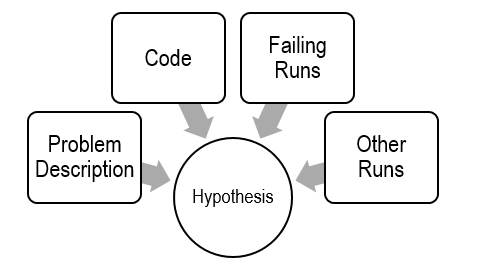
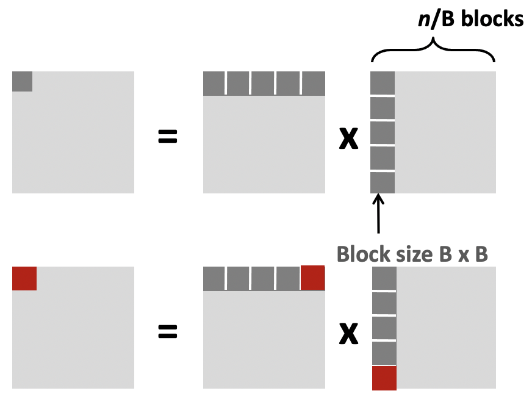

> ## 1. Defects and Infections
>
> - A systematic approach to debugging. 
>   - The programmer creates a defect 
>   - The defect causes an infection 
>   - The infection propagates 
>   - The infection causes a failure
> - Not every defect causes a failure!
> - Testing can only show the presence of errors - not their absence. 
>   - In other words, if you pass every tests, it means that your program has yet to fail. 
>   It does not mean that your program is correct. 
{: .slide}

> ## 2. Explicit debugging
>
> - Stating the problem
>   - Describe the problem aloud or in writing
>   - A.k.a. `Rubber duck` or `teddy bear` method
> - Often a comprehensive problem description is sufficient to solve the failure
{: .slide}

> ## 3. Scientific debugging
>
> - Before debugging, you need to construct a hypothesis as to the defect.
>   - Propose a possible defect and why it explains the failure conditions
> - `Ockham’s Razor`: given several hypotheses, pick the simplest/closest to current work
>
> 
>
> - Make predictions based on your hypothesis
>   - What do you expect to happen under new conditions
>   - What data could confirm or refute your hypothesis
> - How can I collect that data?
>   - What experiments?
>   - What collection mechanism?
> - Does the data refute the hypothesis?
>   - Refine the hypothesis based on the new inputs
{: .slide}

> ## 4. Hands on: bad Fibonacci
>
> - Specification defined the first Fibonacci number as 1. 
> - Compile and run the following `bad_fib.c` program:
> - `fib(1)` returns an incorrect result. Why?
>
> ~~~
> $ gcc -o bad_fib bad_fib.c
> $ ./bad_fib
> ~~~
>  
> 
>
> - Constructing a hypothesis: 
>   - `while (n > 1)`: did we mess up the loop in fib?
>   - `int f`: did we forget to initialize `f`?
> - Propose a new condition or conditions
>   - What will logically happen if your hypothesis is correct?
>   - What data can be 
>   - fib(1) failed		// Hypothesis
>     - Loop check is incorrect: Change to n >= 1 and run again.
>     - f is uninitialized: Change to int f = 1;
> - Experiment
>   - Only change one condition at a time. 
>   - fib(1) failed		// Hypothesis
>     - Change to `n >= 1`: ???
>     - Change to `int f = 1`: Works.  Sometimes a prediction can be a fix.
{: .slide}

> ## 5. Hands on: brute force approach
>
> - Strict compilation flags: `-Wall`, `-Werror`. 
> - Include optimization flags: `-O3` or `-O0`. 
>
> ~~~
> $ gcc -Wall -Werror -O3 -o bad_fib bad_fib.c
> ~~~
>  
> - Use `valgrind`, memory analyzer. 
>
> ~~~
> $ gcc -Wall -Werror -o bad_fib bad_fib.c
> $ valgrind bad_fib
> ~~~
{: .slide}

> ## 6. Observation
>
> - What is the observed result?
>   - Factual observation, such as `Calling fib(1) will return 1.`
>   - The conclusion will interpret the observation(s)
> - Don’t interfere.
>   - Sometimes `printf()` can interfere
>   - Like quantum physics, sometimes observations are part of the experiment
> - Proceed systematically.
>   - Update the conditions incrementally so each observation relates to a specific change
> - Do NOT ever proceed past first bug.
>  
{: .slide}

> ## 7. Learn
>
> - Common failures and insights
>   - Why did the code fail?
>   - What are my common defects?
> - Assertions and invariants
>   - Add checks for expected behavior
>   - Extend checks to detect the fixed failure
> - Testing
>   - Every successful set of conditions is added to the test suite
>  
{: .slide}

> ## 8. Quick and dirty
>
> - Not every problem needs scientific debugging
> - Set a time limit: (for example)
>   - 0 minutes – -Wall, valgrind
>   - 1 – 10 minutes – Informal Debugging
10 – 60 minutes – Scientific Debugging
> 60 minutes – Take a break / Ask for help
>  
{: .slide}

> ## 8. Code optimization: Rear Admiral Grace Hopper
>
> - Invented first compiler in 1951 (technically it was a linker)
> - Coined `compiler` (and `bug`)
> - Compiled for Harvard Mark I
> - Eventually led to COBOL (which ran the world for years)
> - "I decided data processors ought to be able to write their programs in English, and the computers 
> would translate them into machine code".
>  
{: .slide}

> ## 9. Code optimization: John Backus
>
> - Led team at IBM invented the first commercially available compiler in 1957
> - Compiled FORTRAN code for the IBM 704 computer
> - FORTRAN still in use today for high performance code
> - "Much of my work has come from being lazy. I didn't like writing programs, and so, when I was working 
> on the IBM 701, I started work on a programming system to make it easier to write programs".
>  
{: .slide}

> ## 10. Code optimization: Fran Allen
>
> - Pioneer of many optimizing compilation techniques
> - Wrote a paper simply called `Program Optimization` in 1966
> - "This paper introduced the use of graph-theoretic structures to encode program content in order 
> to automatically and efficiently derive relationships and identify opportunities for optimization".
> - First woman to win the ACM Turing Award (the **Nobel Prize of Computer Science**).
>  
{: .slide}

> ## 11. Performance realities
>
> - There’s more to performance than asymptotic complexity.
> - Constant factors matter too!
>   - Easily see 10:1 performance range depending on how code is written
>   - Must optimize at multiple levels: algorithm, data representations, procedures, and loops
> - Must understand system to optimize performance
>   - How programs are compiled and executed
>   - How modern processors + memory systems operate
>   - How to measure program performance and identify bottlenecks
>   - How to improve performance without destroying code modularity and generality.
>  
{: .slide}

> ## 12. Leveraging cache blocks
>
> - Check the size of cache blocks 
>
> ~~~
> $ getconf -a | grep CACHE
> ~~~
> {: .language-bash}
>
> 
> 
> - We focus on cache blocks for optimization:
>   - If caculations can be performed using smaller matrices of
>   A, B, and C (blocks) that all fit in cache, we can further
>   minimize the amount of cache misses per calculation. 
> 
> 
>
> - 3 blocks are needed (for A, B, and C). 
> - Each block has dimension B, so the total block size is B2
> - Therefore: 3B2 < cache_size
> - Based on the information above: B = 8 (so that `8 * 8 = 64` fits
> in cache line).
> - `3 * 8 * 8 < 32768`.
> 
{: .slide}

> ## 13. Hands-on: 
>
> - Check the size of cache blocks 
>
> ~~~
> $ getconf -a | grep CACHE
> ~~~
> {: .language-bash}
>
> 
>
{: .slide}



