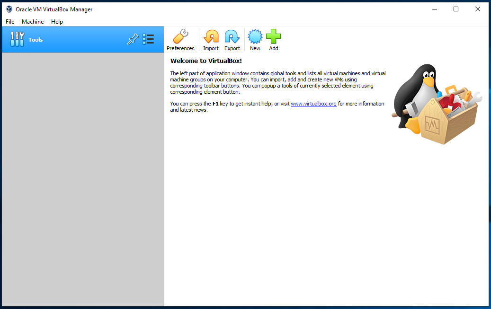
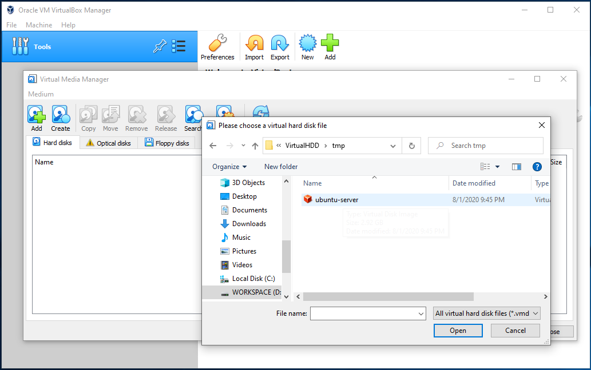
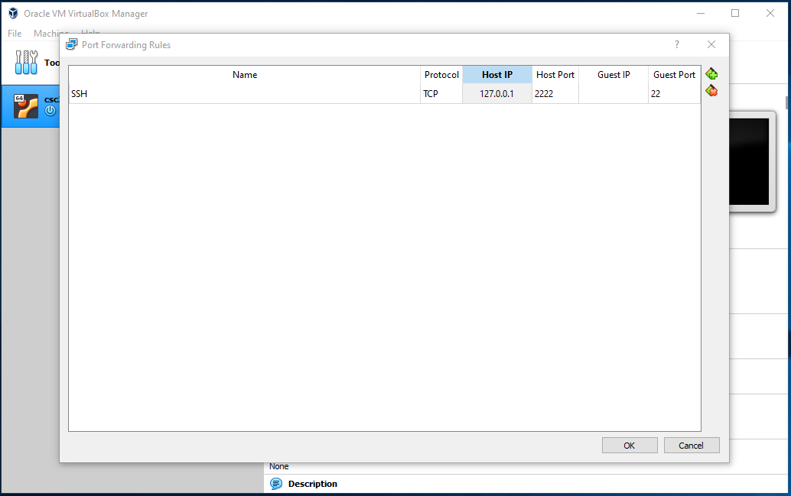
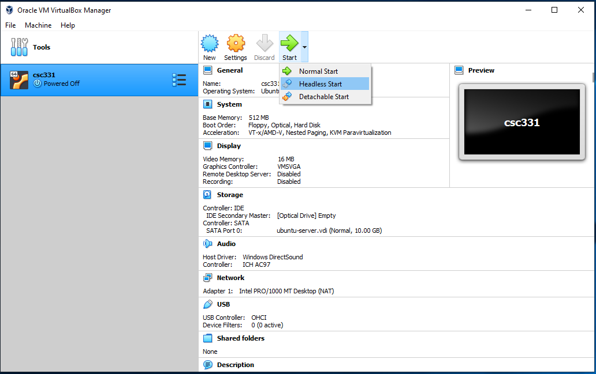
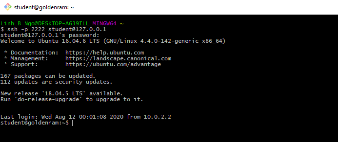
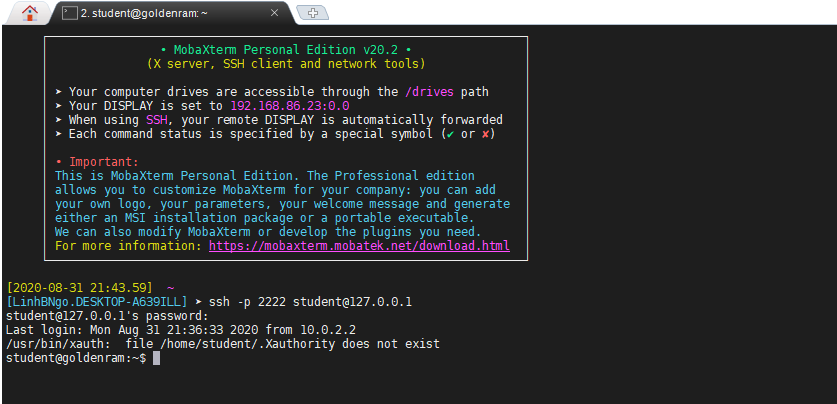

## Installation of VirtualBox

- To emulate an operating system, we will use VirtualBox.
- Even if you are already running Linux or Linux/Unix-based OSes (e.g., Mac, ChromeOS ...), 
it is necessary to use VirtualBox to create an isolated environment for operating system.
- The installation file can be downloaded from [VirtualBox's Download Page][virtualbox].
- Install VirtualBox by following the [online instruction page](https://www.virtualbox.org/manual/UserManual.html#installation).

## Setup CSC331 virtual image

- Download the 64-bit disk image from the following link: [http://bit.ly/2GzKM3e](http://bit.ly/2GzKM3e). 
- For 32-bit, use [the following image](https://drive.google.com/file/d/1gZU6r8R7DZPITNIjGAflFFAuQ5bq1zth/view?usp=sharing).
- On the menu bar of VirtualBox, click **File**, then select **Virtual Media Manager**. 

- Click **Add**, navigate to select the downloaded disk image, then click **Open**. 
- Once the image is added, click **Close**. 

- Click **New** to bring up the Create Virtual Machine dialog.
- Type in a **Name** for the virtual machine (csc331).
- You can keep the **Machine Folder** to its default location, or selection another location 
if you have additional hard drives with more space.
  - **Type** is `Linux`
  - **Version** is `Ubuntu (64-bit)` if it is available. Else you need to download the 32-bit version from above. 
- Click **Next**

- Memory size can be kept at 521 MB
- Click Next

- For Hard disk, click **Use existing virtual hard disk file**
- Select the **ubuntu-server.vdi** file that you added earlier.
- Click **Create**. 

- The VM is now created and appeared on the left windows. 
- Click **OK**
- Next, select the VM and click the yellow **Settings** gear button. 
- Select **Network** then click **Port Forwarding**. 

- Click the green **Add rule** button (top right) and enter the information as 
shown in the figure below. 
- Click **OK** when done. 

- Start the VM in **headless** mode, as shown below:

## Access CSC331 from the terminal

- It is possible to SSH directly into csc331 after port forwarding is created. 
- Caveat: you will need to learn how to use terminal-based editor. 
- To SSH into csc331, the following command can be used on a terminal that has SSH:

~~~
ssh -p 2222 student@127.0.0.1
~~~
{: .language-bash}

By default, MacOS's terminal will have SSH. 
For Windows, you can try to use `PowerShell`. 

If an error is returned (something to the effect of SSH not found), you will need to download and 
install one of the followings:

- [Download and install Git](https://git-scm.com/downloads), then run `Git Bash` application.

- [Download, unzip, then install MobaXTerm](https://mobaxterm.mobatek.net/download-home-edition.html). Either portable or installer edition is fine. 

- Review [the following document](https://www.howtogeek.com/howto/42980/the-beginners-guide-to-nano-the-linux-command-line-text-editor/) to learn about `nano`, a CLI editor.


