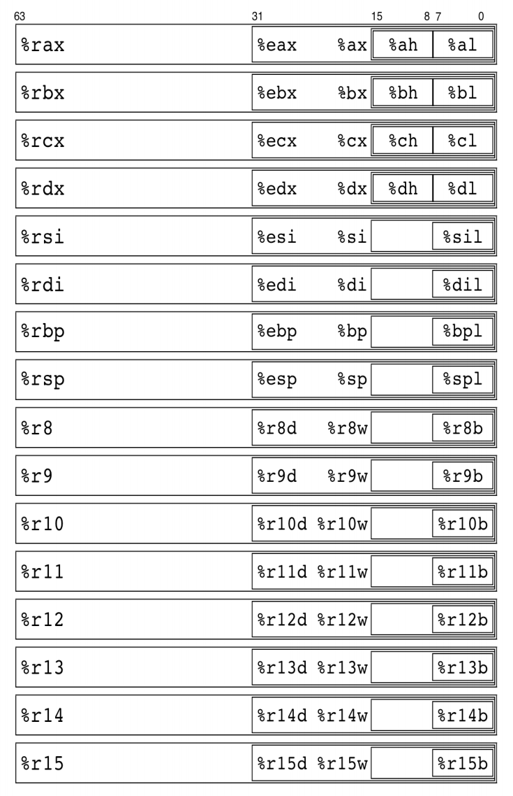
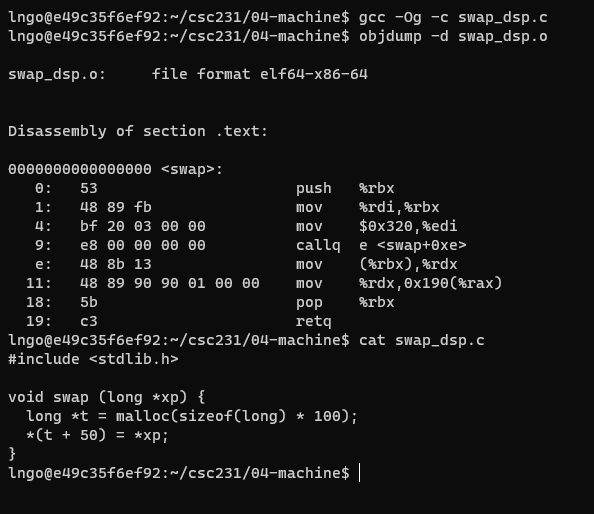
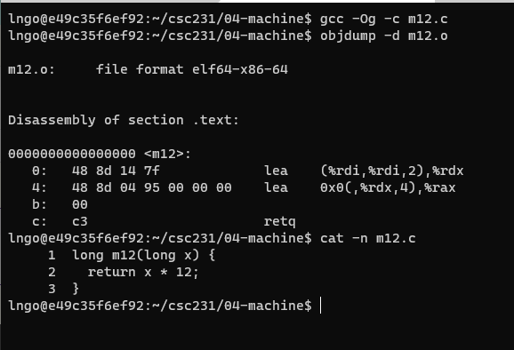
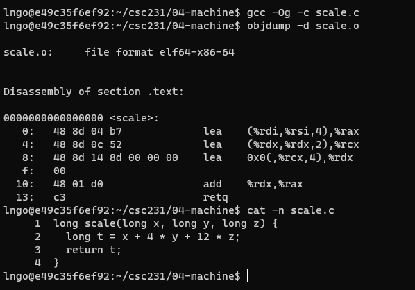
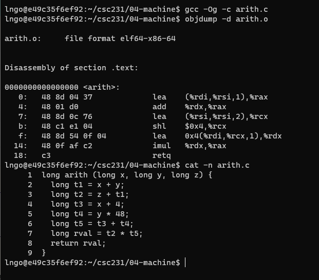
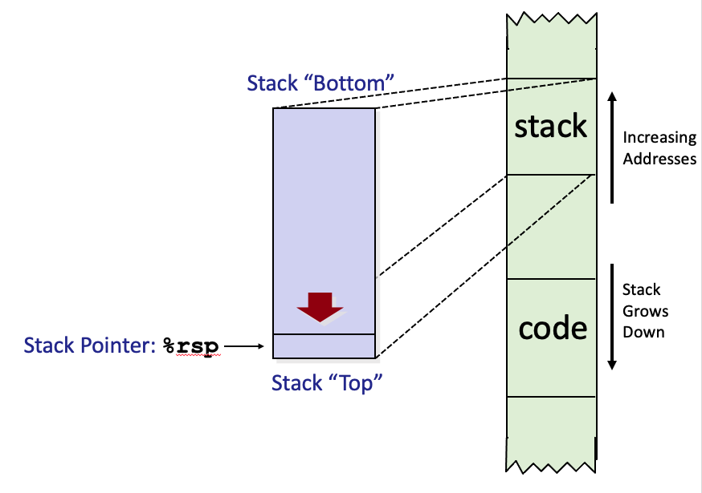
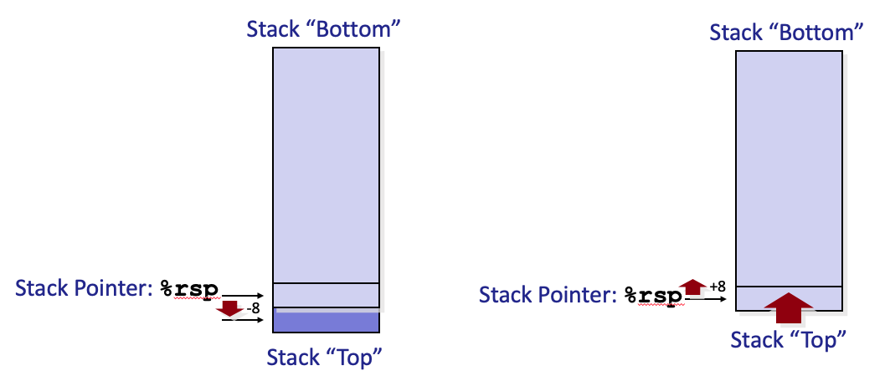

# Machine language

```{admonition} Relevant Reading
:class: tip

This lecture will cover contents from [Chapter 6](https://diveintosystems.org/book/C6-asm_intro/index.html) and [Chapter 7](https://diveintosystems.org/book/C7-x86_64/index.html) of the book. 

```

## 1. Intel x86 processors

```{admonition} Overview
:class: dropdown

- Dominate laptop/desktop/server market
- Evolutionary design
  - Backwards compatible up until 8086, introduced in 1978
  - Added more features as time goes on
- x86 is a Complex Instruction Set Computer (CISC)
  - Many different instructions with many different formats
  - But, only small subset encountered with Linux programs
- Compare: Reduced Instruction Set Computer (RISC)
  - RISC: *very few* instructions, with *very few* modes for each
  - RISC can be quite fast (but Intel still wins on speed!)
  - Current RISC renaissance (e.g., ARM, RISC V), especially for low-power
```

```{admonition} Transistor
:class: dropdown

- Building blocks modern electronics 
- Two transistors used to design an AND gate:


```

```{admonition} Intel and AMD
:class: dropdown

:::::{tab-set}
::::{tab-item} Intel

| Name            | Date | Transistor Counts |  
| --------------- | ---- | ----------------- |  
| 386             | 1985 | 0.3M              |   
| Pentium         | 1993 | 3.1M              |  
| Pentium/MMX     | 1997 | 4.5M              |  
| Pentium Pro     | 1995 | 6.5M              |  
| Pentium III     | 1999 | 8.2M              |  
| Pentium 4       | 2000 | 42M               |  
| Core 2 Duo      | 2006 | 291M              |  
| Core i7         | 2008 | 731M              |  
| Core i7 Skylake | 2015 | 1.75B             |  


- Added features
  - Instructions to support multimedia operations
  - Instructions to enable more efficient conditional operations (**!**)
  - Transition from 32 bits to 64 bits
  - More cores
::::
::::{tab-item} AMD

| Name            | Date | Transistor Counts |  
| --------------- | ---- | ----------------- |  
| AMD K5          | 1996 | 4.3M              |   
| AMD K6          | 1997 | 8.8M              |  
| AMD K6/III      | 1998 | 21.3M             |  
| AMD K7          | 1999 | 22.0M             |  
| AMD K8          | 2003 | 105.9M            |  
| AMD Opteron     | 2009 | 904M              |  
| AMD Bulldozer   | 2012 | 1.2B              |  
| AMD Ryzen 5     | 2017 | 4.8B              |  
| AMD Epyc        | 2017 | 19.2B             | 

- x86 clones: Advanced Micro Devices (AMD)
- Historically
  - AMD has followed just behind Intel
  - A little bit slower, a lot cheaper
- Then
  - Recruited top circuit designers from Digital Equipment Corp. 
  and other downward trending companies
  - Built Opteron: tough competitor to Pentium 4
  - Developed x86-64, their own extension to 64 bits
- Recent Years
  - Intel got its act together
    - 1995-2011: Lead semiconductor “fab” in world
    - 2018: #2 largest by $$ (#1 is Samsung)
    - 2019: reclaimed #1
- AMD fell behind
  - Relies on external semiconductor manufacturer GlobalFoundaries
  - ca. 2019 CPUs (e.g., Ryzen) are competitive again
  - 2020 Epyc
::::
:::::

```

## 2. Machine programming: levels of abstraction

```{admonition} Overview
:class: dropdown


- `Architecture`: (also `ISA`: instruction set architecture) The parts of a processor 
design that one needs to understand for writing correct machine/assembly code
  - Examples:  instruction set specification, registers
  - `Machine Code`: The byte-level programs that a processor executes
  - `Assembly Code`: A text representation of machine code
- `Microarchitecture`: Implementation of the architecture
  - Examples: cache sizes and core frequency
- Example ISAs: 
  - Intel: x86, IA32, Itanium, x86-64
  - ARM: Used in almost all mobile phones
  - RISC V: New open-source ISA
```


```{admonition} Assembly/Machine code view
:class: dropdown

- Machine code (Assembly code) differs greatly from the original C code. 
- Parts of processor state that are not visible/accessible from C programs 
are now visible. 
  - PC: Program counter
    - Contains address of next instruction
    - Called `%rip` (instruction pointer register)
  - Register file
    - contains 16 named locations (registers), each can store 64-bit values. 
    - These registers can hold addresses (~ C pointers) or integer data. 
  - Condition codes
    - Store status information about most recent arithmetic or 
    logical operation
    - Used for conditional branching (`if`/`while`)
  - Vector registers to hold one or more integers or floating-point values. 
  - Memory
    - Is seen  as a byte-addressable array
    - Contains code and user data
    - Stack to support procedures


```


```{admonition} Hands on: assembly/machine code example
:class: dropdown

- Inside your `csc231`, create another directory called `04-machine` and change 
into this directory.
- Create a file named `mstore.c` with the following contents:

<script src="https://gist.github.com/linhbngo/d1e9336a82632c528ea797210ed0f553.js?file=mstore.c"></script>

- Run the following commands 
*It is capital o, not number 0*

~~~bash
$ gcc -Og -S mstore.c
$ cat mstore.s
$ gcc -Og -c mstore.c
$ objdump -d mstore.o
~~~


- x86_64 instructions range in length from 1 to 15 bytes
- The disassembler determines the assembly code based purely on the 
byte-sequence in the machine-code file. 
- All lines begin with `.`  are directirves to the assembler and linker. 

```


## 3. Assembly language

```{admonition} Overview
:class: dropdown

- Symbolic coding
- Very strong correspondence between the language syntax and the 
microarchitecture's machine code instructions
- ../figure from **Programming the IBM 1401 Manual** (1962)


````

```{admonition} Data format
:class: dropdown

:::::{tab-set}
::::{tab-item} Intel data type

| C data type | Intel data type  | Assembly-code suffix | Size  |  
| ----------- | ---------------- | -------------------- | ----- |  
| char        | Byte             | b                    | 1     |  
| short       | Word             | w                    | 2     |  
| int         | Double word      | l                    | 4     |  
| long        | Quad word        | q                    | 8     |  
| char *      | Quad word        | q                    | 8     |  
| float       | Single precision | s                    | 4     |  
| double      | Double precision | l                    | 8     |  

::::
:::::

```

```{admonition} Integer registers
:class: dropdown

- x86_64 CPU contains a set of 16 `general purpose registers` storing 64-bit values.  
- Original 8086 design has eight 16-bit registers, `%ax` through `%sp`. 
  - Origin (mostly obsolete)
    - `%ax`: accumulate
    - `%cx`: counter
    - `%dx`: data
    - `%bx`: base
    - `%si`: source index
    - `%di`: destination index
    - `%sp`: stack pointer
    - `%bp`: base pointer
- After IA32 extension, these registers grew to 32 bits, labeled `%eax` through `%esp`. 
- After x86_64 extension, these registers were expanded to 64 bits, labeled `%rax` 
through `%rsp`. Eight new registered were added: `%r8` through `%r15`. 
- Instructions can operate on data of different sizes stored in low-order bytes of the
16 registers. 



*Bryant and O' Hallaron, Computer Systems: A Programmer's Perspective, Third Edition*

```

```{admonition} Axsembly characteristics: Operations
:class: dropdown

- Transfer data between memory and register
  - Load data from memory into register
  - Store register data into memory
- Perform arithmetic function on register or memory data
- Transfer control
  - Unconditional jumps to/from procedures
  - Conditional branches
  - Indirect branches

```

## 4. Data movement

```{admonition} Definition
:class: dropdown

- Example: `movq Source, Dest`
- Note: This is ATT notation. Intel uses `mov Dest, Source`
- Operand Types for `Source` and `Dest`:
  - Immediate (Imm): Constant integer data. 
     - `$0x400`, `$-533`. 
     - Like C constant, but prefixed with `$`.
     - Encoded with 1, 2, or 4 bytes. 
  - Register (Reg): One of 16 integer registers
     - Example: `%rax`, `%r13`
     - `%rsp` reserved for special use. 
     - Others have special uses in particular instructions. 
  - Memory (Mem): 8 (`q` in `movq`) consecutive bytes of memory at 
  address given by register. 
     - Example: `(%rax)`
     - Various other **addressing mode** (See textbook page 181, ../figure 3.3). 
- Other `mov`:
  - `movb`: move byte
  - `movw`: move word
  - `movl`: move double word
  - `movq`: move quad word
  - `moveabsq`: move absolute quad word

```

```{admonition} movq Operand Combinations
:class: dropdown

:::::{tab-set}
::::{tab-item} 

| `movq` | Source | Dest  | Src, Dest           |  C Analog    |
| ------ | ------ | ----- | ------------------- | ------------ |
|        | Imm    | Reg   | `movq $0x4, %rax`   | tmp = 0x4;   |
|        | Imm    | Mem   | `movq $-147,(%rax)` | *p = -147;   |
|        | Reg    | Reg   | `movq %rax,%rdx`    | tmp2 = tmp1; |
|        | Reg    | Mem   | `movq %rax,(%rdx)`  | *p = tmp;    |
|        | Mem    | Reg   | `movq (%rax),%rdx`  | tmp = *p;    |
::::
:::::

```

```{admonition} Simple memory addressing mode
:class: dropdown

- Normal:	(R)	Mem[Reg[R]]
  - Register R specifies memory address
  - Aha! Pointer dereferencing in C
  - `movq (%rcx),%rax`
- Displacement	D(R)	Mem[Reg[R]+D]
  - Register R specifies start of memory region
  - Constant displacement D specifies offset
  - `movq 8(%rbp),%rdx`

```

```{admonition} x86_64 Assembly Cheatsheet
:class: dropdown

[Brown University - Dr. Doeppner](https://cs.brown.edu/courses/cs033/docs/guides/x64_cheatsheet.pdf)

```

```{admonition} Hands on: swapping via single-valued pointers
:class: dropdown

- Create a file named `swap.c` in `04-machine` with the following contents:

<script src="https://gist.github.com/linhbngo/d1e9336a82632c528ea797210ed0f553.js?file=swap.c"></script>

- Run the following commands 

~~~bash
$ gcc -Og -c swap.c
$ objdump -d swap.o
~~~


- [Why `%rsi` and `%rdi`?](http://6.s081.scripts.mit.edu/sp18/x86-64-architecture-guide.html)
- Procedure Data Flow:
  - First six parameters of a function will be placed into 
  `rdi`, `rsi`, `rdx`, `rcx`, `r8`, `r9`. 
  - The remaining parameters will be pushed on to the stack of the calling function.

```


```{admonition} Hands on: swapping positions in an array (via pointer)
:class: dropdown

- Create a file named `swap_dsp.c` in `04-machine` with the following contents:

<script src="https://gist.github.com/linhbngo/d1e9336a82632c528ea797210ed0f553.js?file=swap_dsp.c"></script>

- Run the following commands 

~~~
$ gcc -Og -c swap_dsp.c
$ objdump -d swap_dsp.o
~~~



- What is the meaning of `0x190`?

```

```{admonition} Complete memory addressing mode
:class: dropdown

- Most General Form
  - `D(Rb,Ri,S)`: `Mem[Reg[Rb]+S*Reg[Ri]+ D]`
  - D: 	Constant **displacement** 1, 2, or 4 bytes
  - Rb: Base register: Any of 16 integer registers
  - Ri:	Index register: Any, except for `%rsp`
  - S: Scale: 1, 2, 4, or 8 
- Special Cases
  - `(Rb,Ri)`:	`Mem[Reg[Rb]+Reg[Ri]]`
  - `D(Rb,Ri)`: `Mem[Reg[Rb]+Reg[Ri]+D]`
  - `(Rb,Ri,S)`: `Mem[Reg[Rb]+S*Reg[Ri]]`
  - `(,Ri,S)`: `Mem[S*Reg[Ri]]`
  - `D(,Ri,S)`: `Mem[S*Reg[Ri] + D]`

```


## 5. Arithmetic operations

```{admonition} lea
:class: dropdown

- `lea`: load effective address
- A form of `movq` intsruction
  - `lea S, D`: Write `&S` to `D`. 
  - can be used to generate pointers
  - can also be used to describe common arithmetic operations. 

```

```{admonition} Hands on: lea
:class: dropdown

- Create a file named `m12.c` in `04-machine` with the following contents:

<script src="https://gist.github.com/linhbngo/d1e9336a82632c528ea797210ed0f553.js?file=m12.c"></script>

- Run the following commands 

~~~
$ gcc -Og -c m12.c
$ objdump -d m12.o
~~~



- Assembly code explanation of `m12.c`:
  - `%rdi`: x
  - `(%rdi, %rdi,2)` = x + 2 * x 
  - The above result is moved to `%rdx` with `lea`. 
  - `0x0(,%rdx,4)` = 4 * (x + 2 * x) = 12*x
  - The above result is moved to `%rax` with `lea`. 

```

```{admonition} Other arithmetic operations
:class: dropdown

- Omitting suffixes comparing to the book. 
- `Src`: `S`
- `Dest`: `D`

:::::{tab-set}
::::{tab-item} Arithmetic operations
| Format          | Computation |  Description       |
| --------------- | ----------- | ------------------ |  
| `add Src,Dest`  | D <- D + S  | add                |   
| `sub Src,Dest`  | D <- D - S  | subtract           |  
| `imul Src,Dest` | D <- D * S  | multiply           |  
| --------------- | ----------- | ------------------ |  
| `shl Src,Dest`  | D <- D << S | shift left         |  
| `sar Src,Dest`  | D <- D >S   | arith. shift right |  
| `shr Src,Dest`  | D <- D >S   | shift right        |  
| `sal Src,Dest`  | D <- D << S | arith. shift left  |  
| --------------- | ----------- | ------------------ |  
| `xor Src,Dest`  | D <- D ^ S  | exclusive or       |  
| `and Src,Dest`  | D <- D & S  | and                |  
| `or Src,Dest`   | D <- D \| S | or                 |  
| --------------- | ----------- | ------------------ |  
| `inc Src`       | D <- D + 1  | increment          |  
| `dec Src`       | D <- D - 1  | decrement          |  
| `neg Src`       | D <- -D     | negate             |  
| `not Src`       | D <- -D     | complement         |  
::::
:::::

- Watch out for argument order (ATT versus Intel)
- No distinction between signed and unsigned int. 
  - Exception: arithmetic right shift (`sar`) where the 
  significant bit is retained. 

```

```{admonition} Challenge: lea
:class: dropdown


- Create a file named `scale.c` in `04-machine` with the following contents:

<script src="https://gist.github.com/linhbngo/d1e9336a82632c528ea797210ed0f553.js?file=scale.c"></script>

- Run the following commands 

~~~bash
$ gcc -Og -c scale.c
$ objdump -d scale.o
~~~





- Identify the registers holding x, y, and z.  
- Which register contains the final return value?


:::{admonition} Solution
:class: dropdown

- `%rdi`: x
- `%rsi`: y
- `%rdx`: z
- `%rax` contains the final return value. 

:::
```

```{admonition} Hands on: long arithmetic
:class: dropdown

- Create a file named `arith.c` in `04-machine` with the following contents:

<script src="https://gist.github.com/linhbngo/d1e9336a82632c528ea797210ed0f553.js?file=arith.c"></script>

- Run the following commands 

~~~
$ gcc -Og -c arith.c
$ objdump -d arith.o
~~~


- Understand how the Assembly code represents the actual arithmetic operation in the C code. 



```


## 6. Logical operations

```{admonition} Quick review: processor state
:class: dropdown

- Information about currently executing program
  - temporary data (`%rax`,...)
  - location of runtime stack (`%rsp`)
  - location of current code control point (`%rip`,...)
  - status of recent tests (`CF`, `ZF`, `SF`, `OF` in `%EFLAGS`)


```


```{admonition} Condition codes (implicit setting)
:class: dropdown

- Single-bit registers
  - `CF`: the most recent operation generated a carry out of the most significant bit. 
  - `ZF`: the most recent operation yielded zero.
  - `SF`: the most recent operation yielded negative. 
  - `OF`: the most recent operation caused a two's-complement overflow. 
- Implicitly set (as side effect) of arithmetic operations. 

```


```{admonition} Condition codes (explicit setting)
:class: dropdown

- Exlicit setting by Compare instruction
  - `cmpq Src2, Src1`
  - `cmpq b, a` like computing `a - b` without setting destination
- `CF` set if carry/borrow out from most significant bit (unsigned comparisons) 
- `ZF` set if `a == b`
- `SF` set if `(a - b) < 0` 
- `OF` set if two's complement (signed) overflow
  - `(a>0 && b<0 && (a-b)<0) || (a<0 && b>0 && (a-b)>0)`

```


```{admonition} Condition branches (jX)
:class: dropdown

- Jump to different part of code depending on condition codes
- Implicit reading of condition codes

:::::{tab-set}
::::{tab-item} Jump operations

| jX    | Condition      |  Description         |
| ----- | -------------- | -------------------- |  
| `jmp` | 1              | direct jump          |   
| `je`  | ZF             | equal/zero           |  
| `jne` | ~ZF            | not equal/not zero   |  
| `js`  | SF             | negative             |  
| `jns` | ~SF            | non-negative         |  
| `jg`  | ~(SF^OF) & ~ZF | greater              |  
| `jge` | ~(SF^OF)       | greater or equal to  |  
| `jl`  | SF^OF          | lesser               |  
| `jle` | SF^OF \| ZF    | lesser or equal to   |  
| `ja`  | ~CF & ~ZF      | above                |    
| `jb`  | CF             | below                |  

::::
:::::

```


```{admonition} Hands on: a simple jump
:class: dropdown

- Create a file named `jump.c` in `04-machine` with the following contents:

<script src="https://gist.github.com/linhbngo/d1e9336a82632c528ea797210ed0f553.js?file=jump.c"></script>

- Run the following commands 

~~~
$ gcc -Og -c jump.c
$ objdump -d jump.o
~~~

- Understand how the Assembly code enables jump across instructions to support conditional workflow. 

><iframe width="560" height="315" src="https://www.youtube.com/embed/OSZggdT9hgY" title="YouTube video player" frameborder="0" allow="accelerometer; autoplay; clipboard-write; encrypted-media; gyroscope; picture-in-picture" allowfullscreen></iframe>

- In the next video, we will look at how `cmp` and `jle` of `absdiff` really behave in an actual execution. 

<iframe width="560" height="315" src="https://www.youtube.com/embed/mOwufRcZS8M" title="YouTube video player" frameborder="0" allow="accelerometer; autoplay; clipboard-write; encrypted-media; gyroscope; picture-in-picture" allowfullscreen></iframe>

```

```{admonition} Hands on: loop
:class: dropdown

- Create a file named `factorial.c` in `04-machine` with the following contents:

<script src="https://gist.github.com/linhbngo/d1e9336a82632c528ea797210ed0f553.js?file=factorial.c"></script>

- Run the following commands 

~~~
$ gcc -Og -c factorial.c
$ objdump -d factorial.o
~~~

- Understand how the Assembly code enables jump across instructions to support loop. 

<iframe width="560" height="315" src="https://www.youtube.com/embed/0N2srmuKcVs" title="YouTube video player" frameborder="0" allow="accelerometer; autoplay; clipboard-write; encrypted-media; gyroscope; picture-in-picture" allowfullscreen></iframe>

- Create `factorial_2.c` and `factorial_3.c` from `factorial.c`. 
- Modify `factorial_2.c` so that the factorial is implemented with a `while` loop. Study the 
resulting Assembly code. 
- Modify `factorial_3.c` so that the factorial is implemented with a `for` loop. Study the 
resulting Assembly code. 
- Behavior of `factorial` Assembly instructions inside GDB

<iframe width="560" height="315" src="https://www.youtube.com/embed/2VdCt8hhiRY" title="YouTube video player" frameborder="0" allow="accelerometer; autoplay; clipboard-write; encrypted-media; gyroscope; picture-in-picture" allowfullscreen></iframe>

```


## 7. Mechanisms in procedures (functions)

```{admonition} Overview
:class: dropdown

- Function = procedure (book terminology)
- Support procedure `P` calls procedure `Q`. 
- Passing control
  - To beginning of procedure code 
    - starting instruction of `Q`
  - Back to return point 
    - next instruction in `P` after `Q`
- Passing data
  - Procedure arguments
    - `P` passes one or more parameters to `Q`. 
    - `Q` returns a value back to `P`. 
  - Return value
- Memory management
  - Allocate during procedure execution and de-allocate upon return
    - `Q` needs to allocate space for local variables and free that storage
    once finishes. 
- Mechanisms all implemented with machine instructions
- x86-64 implementation of a procedure uses only those mechanisms required
- Machine instructions implement the mechanisms, but the choices are determined by designers. 
These choices make up the **Application Binary Interface (ABI).**

```

```{admonition} x86-64 stack
:class: dropdown

- Region of memory managed with stack discipline
  - Memory viewed as array of bytes.
  - Different regions have different purposes.
  - (Like ABI, a policy decision)
- Grows toward lower addresses
  - Register `%rsp` contains **lowest stack address**. 
  - address of "top" element



```

```{admonition} Stack push and pop
:class: dropdown

- `pushq Src`
  - Fetch operand at `Src`
  - Decrement `%rsp` by 8
  - Write operand at address given by `%rsp`
- `popq Dest`
  - Read value at address given by `%rsp`
  - Increment `%rsp` by 8
  - Store value at Dest (usually a register)



```

```{admonition} What really happens in memory/registers at the beginning and the end of a function
:class: dropdown

- The `-Og` flag often combines/reduces these steps. 
- The memory stack architecture for a function has a base pointer (`$rbp`) and a 
stack pointer (`$rsp`).
  - Base pointer: the bottom of the stack (higher memory address)
  - Stack pointer: the top of the stack (lower memory address)
- Function prologue
  - Push the current  base pointer onto the memory stack (to be restored later). 
  - Assign the value of the base pointer (set the `$rbp` to that value) to the current
  address pointed to by the stack pointer. 
  - Move the stack pointer down further (*push* new memory in) a distance that would 
  accommodate local variables of the function. 
- Function prologue (Assembly), ATT notation, assume rbp/ebp and rsp/esp
  - `push $rbp`
  - `mov $rsp, $rbp`
  - `sub  N, $rsp`
- Function epilogue
  - Drop the stack pointer to the current base pointer, so room reserved in the prologue for 
  local variables is freed.
  - Pops the base pointer off the stack, so it is restored to its value before the prologue.
  - Returns to the calling function, by popping the previous frame's program counter off the 
  stack and jumping to it.
 - Function prologue (Assembly), ATT notation, assume rbp/ebp and rsp/esp
  - `mov $rbp, $rsp`
  - `pop $rbp`
  - `ret`
- Video lecture on the slide

<iframe width="560" height="315" src="https://www.youtube.com/embed/DwGreRQzvzI" title="YouTube video player" frameborder="0" allow="accelerometer; autoplay; clipboard-write; encrypted-media; gyroscope; picture-in-picture" allowfullscreen></iframe>

```

```{admonition} Hands on: function calls
:class: dropdown

- Create a file named `mult.c` in `04-machine` with the following contents:

<script src="https://gist.github.com/linhbngo/d1e9336a82632c528ea797210ed0f553.js?file=mult.c"></script>

- Description of C code:

<iframe width="560" height="315" src="https://www.youtube.com/embed/R999iekcaUg" title="YouTube video player" frameborder="0" allow="accelerometer; autoplay; clipboard-write; encrypted-media; gyroscope; picture-in-picture" allowfullscreen></iframe>

- Compile with `-g` flag and run `gdb` on the resulting executable.  

~~~
$ gcc -g -o mult mult.c
$ gdb mult
~~~


- Setup gdb with a breakpoint at `main` and start running. 
- A new GDB command is `si`: executing the next instruction (machine or code instruction). 
  - It will execute the highlighted (greened and arrowed) instruction in the `code` section.
  - If the Assembly instruction is *calling* another function, we need to use `ni` if we don't want to step into that instruction. 
- **Be careful, Intel notation in the code segment of GDB**
- `endbr64` is a new instruction to help enforce [Control Flow Technology](https://www.intel.com/content/www/us/en/developer/articles/technical/technical-look-control-flow-enforcement-technology.html) to prevent potential *stitching* of malicious Assembly codes. 

```

```{admonition} Data alignment
:class: dropdown

- Intel recommends data to be aligned to improve memory system performance. 
  - K-alignment rule: Any primitive object of `K` bytes must have an address that is multiple of `K`: 1 for `char`, 2 for `short`, 4 for `int` and `float`, and 8 for `long`, `double`, and `char *`. 

```


