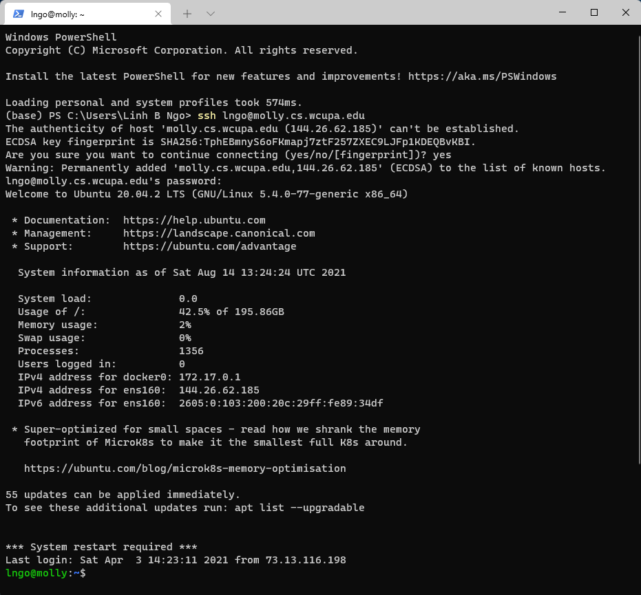

- This semester, we will utilize the department server, `molly`, for all our in-class hands-on, 
assignments, and lab activities. To connect to `molly`, we will use a mechanism called `Secure Shell`,
or `SSH`. 

- `SSH` is a cryptographic network protocol for secure communication over an unsecured network. `SSH`
allows us to open a command-line terminal to login to `molly`. 

> ## Access to molly server
> 
> - Student accounts for `molly` are created on the first day of class. 
>   - The professor will hand out login name/password. 
>   - The password is not the same as your WCUPA password. 
> - Students added later to the class should contact the professor to request access to `molly`. 
{:.callout}

> ## Command line terminal software on Windows
> 
> - Download and install [Windows Terminal from the Microsoft Store](https://www.microsoft.com/en-us/p/windows-terminal/9n0dx20hk701?activetab=pivot:overviewtab).
>
{: .slide}

> ## Command line terminal software on Mac
>
> - Use the Search box (magnifying glass on top-right of your Mac Desktop) and type in the word `Terminal`. 
> - Launch the resulting Terminal app. 
>
{: .slide}

> ## Connect to molly via SSH
>
> - Launch the Terminal application (windows or Mac). 
> - Type the following and press `Enter`. 
>   - `USERID` is **your** WCUPA email login without the `@wcupa.edu` part. 
> - If/when asked `Are you sure you want to continue connecting (/yes/no/[fingerprint])?`, 
> type `yes` and press Enter. 
>
> > ~~~
> > ssh USERID@molly.cs.wcupa.edu
> > ~~~
> > {: .language-bash}
>
> 
>
{: .slide}


